# [📈 Live Status](https://santaclaraca.github.io/upptime): <!--live status--> **🟧 Partial outage**

This repository contains the open-source uptime monitor and status page for [santaclaraca](https://santaclaraca.github.io/upptime), powered by [Upptime](https://github.com/upptime/upptime).

With [Upptime](https://upptime.js.org), you can get your own unlimited and free uptime monitor and status page, powered entirely by a GitHub repository. We use [Issues](https://github.com/santaclaraca/upptime/issues) as incident reports, [Actions](https://github.com/santaclaraca/upptime/actions) as uptime monitors, and [Pages](https://santaclaraca.github.io/upptime) for the status page.

<!--start: status pages-->
<!-- This summary is generated by Upptime (https://github.com/upptime/upptime) -->
<!-- Do not edit this manually, your changes will be overwritten -->
<!-- prettier-ignore -->
| URL | Status | History | Response Time | Uptime |
| --- | ------ | ------- | ------------- | ------ |
|  [City of Santa Clara](https://www.santaclaraca.gov) | 🟩 Up | [city-of-santa-clara.yml](https://github.com/santaclaraca/upptime/commits/HEAD/history/city-of-santa-clara.yml) | 

 663ms
     
 | 

<a href="https://santaclaraca.github.io/upptime/history/city-of-santa-clara">100.00%</a>
    

|  [Admin](https://www.santaclaraca.gov/Admin) | 🟩 Up | [admin.yml](https://github.com/santaclaraca/upptime/commits/HEAD/history/admin.yml) | 

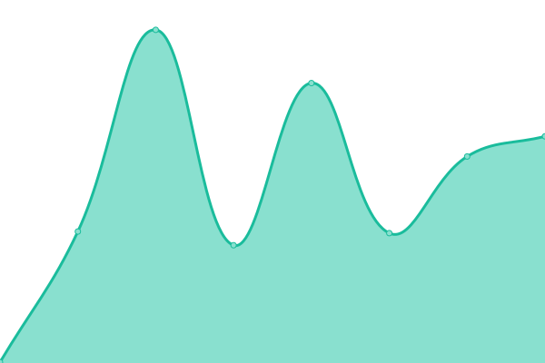 205ms
     
 | 

<a href="https://santaclaraca.github.io/upptime/history/admin">100.00%</a>
    

|  [E-mails](https://admin.govdelivery.com) | 🟩 Up | [e-mails.yml](https://github.com/santaclaraca/upptime/commits/HEAD/history/e-mails.yml) | 

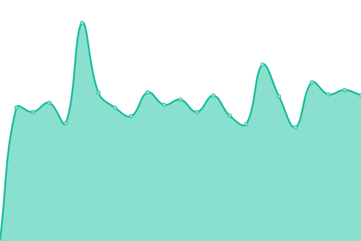 352ms
     
 | 

<a href="https://santaclaraca.github.io/upptime/history/e-mails">100.00%</a>
    

|  [Silicon Valley Animal Control Authority](https://www.svaca.com) | 🟩 Up | [silicon-valley-animal-control-authority.yml](https://github.com/santaclaraca/upptime/commits/HEAD/history/silicon-valley-animal-control-authority.yml) | 

 770ms
     
 | 

<a href="https://santaclaraca.github.io/upptime/history/silicon-valley-animal-control-authority">100.00%</a>
    

|  [Silicon Valley Power](https://www.siliconvalleypower.com) | 🟩 Up | [silicon-valley-power.yml](https://github.com/santaclaraca/upptime/commits/HEAD/history/silicon-valley-power.yml) | 

 606ms
     
 | 

<a href="https://santaclaraca.github.io/upptime/history/silicon-valley-power">100.00%</a>
    

|  [Fiber Connect](https://www.svpfiber.com) | 🟩 Up | [fiber-connect.yml](https://github.com/santaclaraca/upptime/commits/HEAD/history/fiber-connect.yml) | 

 477ms
     
 | 

<a href="https://santaclaraca.github.io/upptime/history/fiber-connect">100.00%</a>
    

|  [Santa Clara City Library](https://www.sclibrary.org) | 🟩 Up | [santa-clara-city-library.yml](https://github.com/santaclaraca/upptime/commits/HEAD/history/santa-clara-city-library.yml) | 

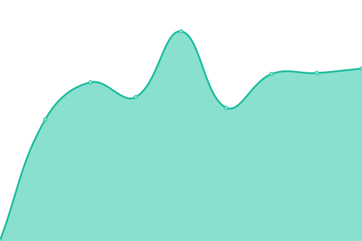 472ms
     
 | 

<a href="https://santaclaraca.github.io/upptime/history/santa-clara-city-library">100.00%</a>
    

|  [Legistar](https://santaclara.legistar.com/) | 🟩 Up | [legistar.yml](https://github.com/santaclaraca/upptime/commits/HEAD/history/legistar.yml) | 

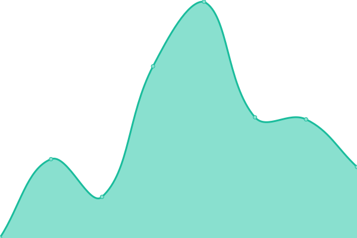 209ms
     
 | 

<a href="https://santaclaraca.github.io/upptime/history/legistar">100.00%</a>
    

|  [Accela](https://aca-prod.accela.com/santaclara) | 🟩 Up | [accela.yml](https://github.com/santaclaraca/upptime/commits/HEAD/history/accela.yml) | 

 342ms
     
 | 

<a href="https://santaclaraca.github.io/upptime/history/accela">100.00%</a>
    

|  [Cludo](https://my.cludo.com) | 🟩 Up | [cludo.yml](https://github.com/santaclaraca/upptime/commits/HEAD/history/cludo.yml) | 

 151ms
     
 | 

<a href="https://santaclaraca.github.io/upptime/history/cludo">100.00%</a>
    

|  [Mark43](https://mark43.com) | 🟩 Up | [mark43.yml](https://github.com/santaclaraca/upptime/commits/HEAD/history/mark43.yml) | 

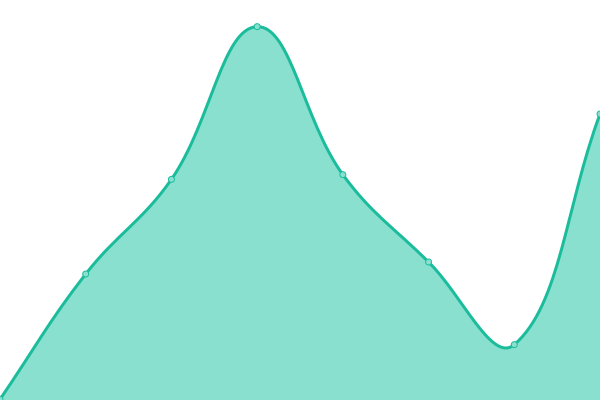 222ms
     
 | 

<a href="https://santaclaraca.github.io/upptime/history/mark43">100.00%</a>
    

|  [SiteImprove](https://id.siteimprove.com/Account/Login) | 🟩 Up | [site-improve.yml](https://github.com/santaclaraca/upptime/commits/HEAD/history/site-improve.yml) | 

 460ms
     
 | 

<a href="https://santaclaraca.github.io/upptime/history/site-improve">100.00%</a>
    

|  [PeopleSoft](https://ESS.SantaClaraCA.gov) | 🟩 Up | [people-soft.yml](https://github.com/santaclaraca/upptime/commits/HEAD/history/people-soft.yml) | 

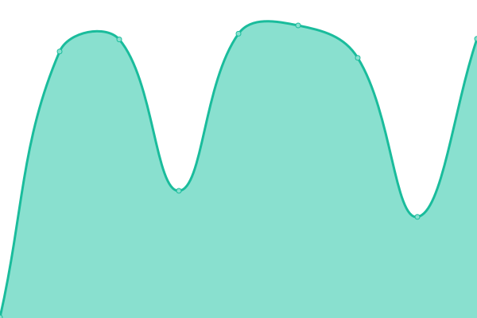 433ms
     
 | 

<a href="https://santaclaraca.github.io/upptime/history/people-soft">100.00%</a>
    

|  [Customer Connect](https://mua.santaclaraca.gov/CC/Login.xml) | 🟩 Up | [customer-connect.yml](https://github.com/santaclaraca/upptime/commits/HEAD/history/customer-connect.yml) | 

 532ms
     
 | 

<a href="https://santaclaraca.github.io/upptime/history/customer-connect">100.00%</a>
    

|  [FTB (check manually)](https://swift.ftb.ca.gov) | 🟥 Down | [ftb-check-manually.yml](https://github.com/santaclaraca/upptime/commits/HEAD/history/ftb-check-manually.yml) | 

 467ms
     
 | 

<a href="https://santaclaraca.github.io/upptime/history/ftb-check-manually">0.00%</a>
    

|  [ArcGIS](https://www.arcgis.com/) | 🟩 Up | [arc-gis.yml](https://github.com/santaclaraca/upptime/commits/HEAD/history/arc-gis.yml) | 

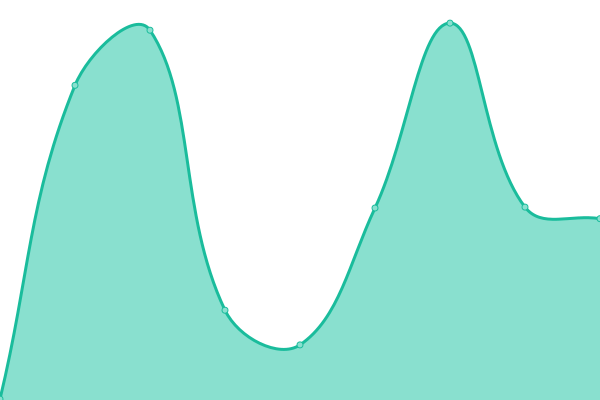 121ms
     
 | 

<a href="https://santaclaraca.github.io/upptime/history/arc-gis">100.00%</a>
    

|  [Site Core](https://www.corebt.com/) | 🟩 Up | [site-core.yml](https://github.com/santaclaraca/upptime/commits/HEAD/history/site-core.yml) | 

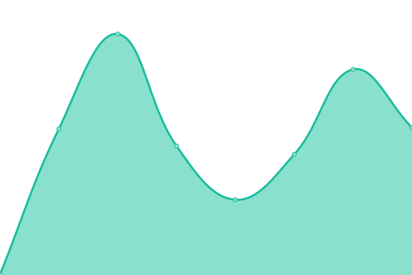 285ms
     
 | 

<a href="https://santaclaraca.github.io/upptime/history/site-core">100.00%</a>
    

|  [HDl](https://www.hdlcompanies.com/) | 🟩 Up | [h-dl.yml](https://github.com/santaclaraca/upptime/commits/HEAD/history/h-dl.yml) | 

 403ms
     
 | 

<a href="https://santaclaraca.github.io/upptime/history/h-dl">100.00%</a>
    

|  [Metaviewer](https://www.metaviewer.com/) | 🟩 Up | [metaviewer.yml](https://github.com/santaclaraca/upptime/commits/HEAD/history/metaviewer.yml) | 

 1207ms
     
 | 

<a href="https://santaclaraca.github.io/upptime/history/metaviewer">100.00%</a>
    

|  [Tiburon RMS](https://prioritydispatch.net/tiburon-inc/) | 🟩 Up | [tiburon-rms.yml](https://github.com/santaclaraca/upptime/commits/HEAD/history/tiburon-rms.yml) | 

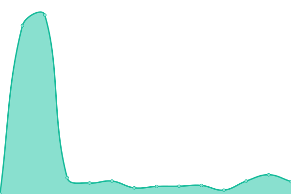 244ms
     
 | 

<a href="https://santaclaraca.github.io/upptime/history/tiburon-rms">100.00%</a>
    

|  [CAD Zetron](https://portal.zetron.com/) | 🟩 Up | [cad-zetron.yml](https://github.com/santaclaraca/upptime/commits/HEAD/history/cad-zetron.yml) | 

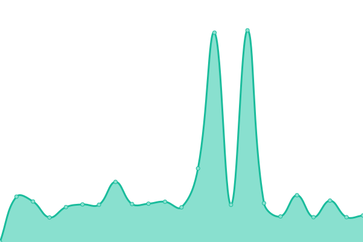 486ms
     
 | 

<a href="https://santaclaraca.github.io/upptime/history/cad-zetron">100.00%</a>
    

|  [ITPipes](https://fortworthsanitary.itpipes.com/) | 🟩 Up | [it-pipes.yml](https://github.com/santaclaraca/upptime/commits/HEAD/history/it-pipes.yml) | 

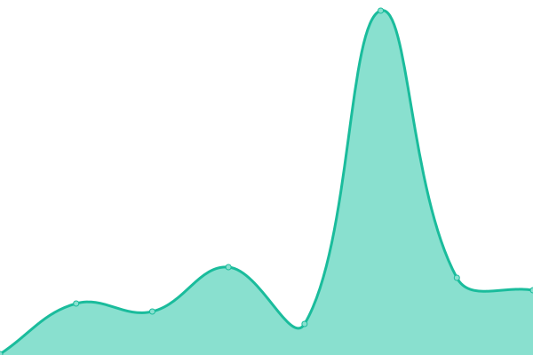 777ms
     
 | 

<a href="https://santaclaraca.github.io/upptime/history/it-pipes">100.00%</a>
    

|  [Nice Systems](https://login.incontact.com/) | 🟩 Up | [nice-systems.yml](https://github.com/santaclaraca/upptime/commits/HEAD/history/nice-systems.yml) | 

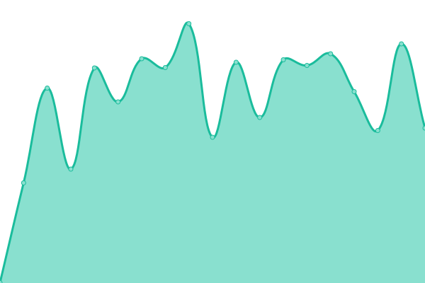 523ms
     
 | 

<a href="https://santaclaraca.github.io/upptime/history/nice-systems">100.00%</a>
    

|  [IntelliVUE](https://intellicloud2.intellinetics.com/intelliCloudVUE/) | 🟩 Up | [intelli-vue.yml](https://github.com/santaclaraca/upptime/commits/HEAD/history/intelli-vue.yml) | 

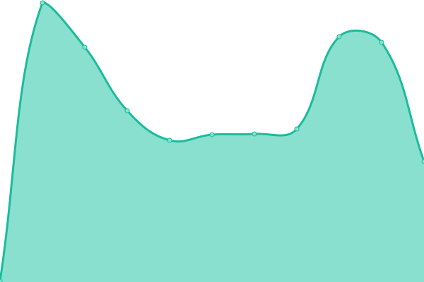 262ms
     
 | 

<a href="https://santaclaraca.github.io/upptime/history/intelli-vue">100.00%</a>
    

|  [Tech Logic](https://www.tech-logic.com/) | 🟩 Up | [tech-logic.yml](https://github.com/santaclaraca/upptime/commits/HEAD/history/tech-logic.yml) | 

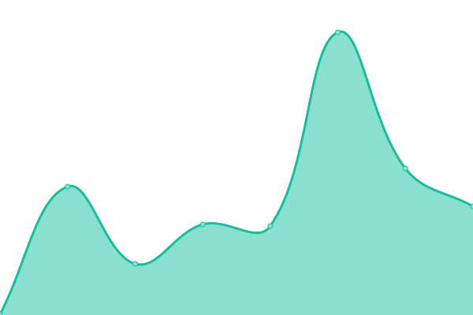 150ms
     
 | 

<a href="https://santaclaraca.github.io/upptime/history/tech-logic">100.00%</a>
    

|  [Faster Fleet Management](https://fasterasset.com/) | 🟩 Up | [faster-fleet-management.yml](https://github.com/santaclaraca/upptime/commits/HEAD/history/faster-fleet-management.yml) | 

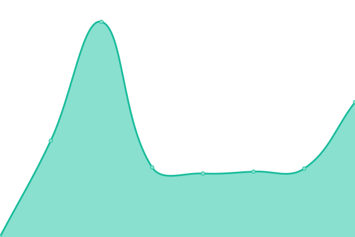 316ms
     
 | 

<a href="https://santaclaraca.github.io/upptime/history/faster-fleet-management">100.00%</a>
    

|  [Linkup](https://linkup.com/) | 🟩 Up | [linkup.yml](https://github.com/santaclaraca/upptime/commits/HEAD/history/linkup.yml) | 

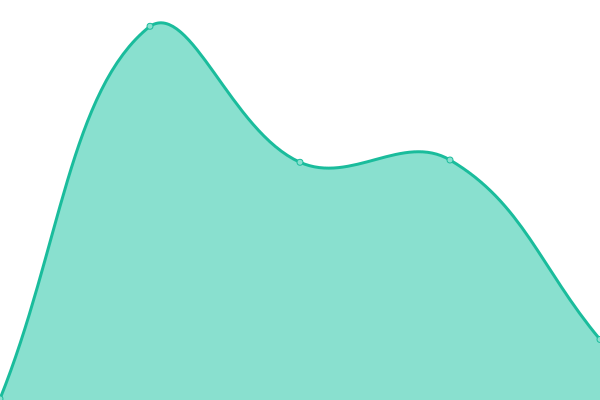 151ms
     
 | 

<a href="https://santaclaraca.github.io/upptime/history/linkup">100.00%</a>
    

|  [C-Cure 9000](https://www.swhouse.com) | 🟩 Up | [c-cure-9000.yml](https://github.com/santaclaraca/upptime/commits/HEAD/history/c-cure-9000.yml) | 

 230ms
     
 | 

<a href="https://santaclaraca.github.io/upptime/history/c-cure-9000">100.00%</a>
    

|  [Imagetrend Elite Rescue (Fire & EMS)](https://www.imagetrend.com/) | 🟩 Up | [imagetrend-elite-rescue-fire-and-ems.yml](https://github.com/santaclaraca/upptime/commits/HEAD/history/imagetrend-elite-rescue-fire-and-ems.yml) | 

 510ms
     
 | 

<a href="https://santaclaraca.github.io/upptime/history/imagetrend-elite-rescue-fire-and-ems">100.00%</a>
    

|  [Laserfish](https://www.laserfiche.com/signon/) | 🟩 Up | [laserfish.yml](https://github.com/santaclaraca/upptime/commits/HEAD/history/laserfish.yml) | 

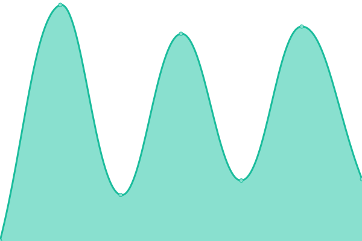 661ms
     
 | 

<a href="https://santaclaraca.github.io/upptime/history/laserfish">100.00%</a>
    

|  [JP Morgan Access](https://access.jpmorgan.com/jpmalogon) | 🟩 Up | [jp-morgan-access.yml](https://github.com/santaclaraca/upptime/commits/HEAD/history/jp-morgan-access.yml) | 

 329ms
     
 | 

<a href="https://santaclaraca.github.io/upptime/history/jp-morgan-access">100.00%</a>
    

|  [Office 365](https://login.microsoftonline.com/) | 🟩 Up | [office-365.yml](https://github.com/santaclaraca/upptime/commits/HEAD/history/office-365.yml) | 

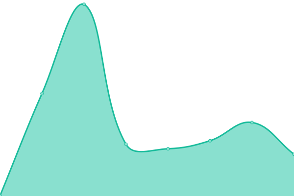 683ms
     
 | 

<a href="https://santaclaraca.github.io/upptime/history/office-365">100.00%</a>
    

|  [Lucity](https://lucityprod.santaclaraca.gov/LucityWeb/Public/Login.aspx?ReturnUrl=%2fLucityWeb%2f) | 🟥 Down | [lucity.yml](https://github.com/santaclaraca/upptime/commits/HEAD/history/lucity.yml) | 

 0ms
     
 | 

<a href="https://santaclaraca.github.io/upptime/history/lucity">0.00%</a>
    

<!--end: status pages-->

[**Visit our status website →**](https://santaclaraca.github.io/upptime)

## 📄 License

- Powered by: [Upptime](https://github.com/upptime/upptime)
- Code: [MIT](./LICENSE) © [santaclaraca](https://santaclaraca.github.io/upptime)
- Data in the `./history` directory: [Open Database License](https://opendatacommons.org/licenses/odbl/1-0/)
