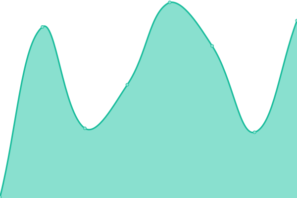
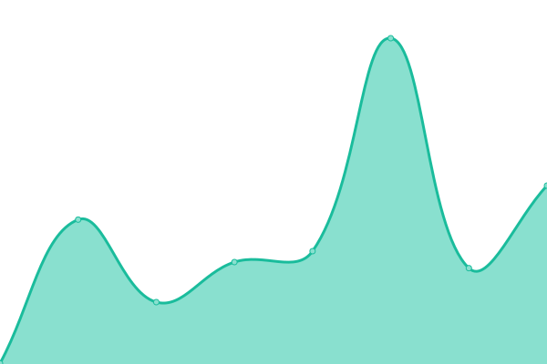
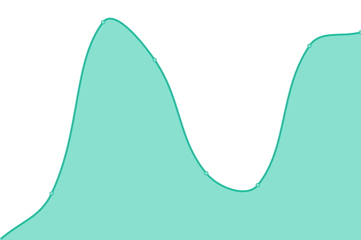
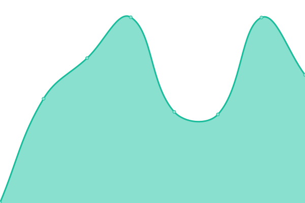
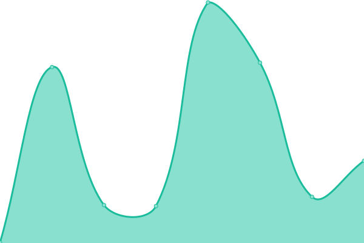
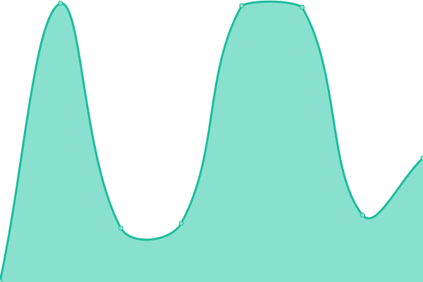
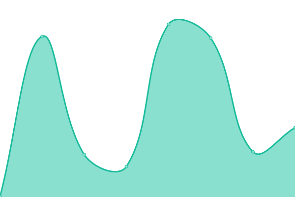

# [📈 Live Status](https://santaclaraca.github.io/upptime): <!--live status--> **🟧 Partial outage**

This repository contains the open-source uptime monitor and status page for [santaclaraca](https://santaclaraca.github.io/upptime), powered by [Upptime](https://github.com/upptime/upptime).

With [Upptime](https://upptime.js.org), you can get your own unlimited and free uptime monitor and status page, powered entirely by a GitHub repository. We use [Issues](https://github.com/santaclaraca/upptime/issues) as incident reports, [Actions](https://github.com/santaclaraca/upptime/actions) as uptime monitors, and [Pages](https://santaclaraca.github.io/upptime) for the status page.

<!--start: status pages-->
<!-- This summary is generated by Upptime (https://github.com/upptime/upptime) -->
<!-- Do not edit this manually, your changes will be overwritten -->
<!-- prettier-ignore -->
| URL | Status | History | Response Time | Uptime |
| --- | ------ | ------- | ------------- | ------ |
|  [City of Santa Clara](https://www.santaclaraca.gov) | 🟩 Up | [city-of-santa-clara.yml](https://github.com/santaclaraca/upptime/commits/HEAD/history/city-of-santa-clara.yml) | 

 449ms
     
 | 

<a href="https://santaclaraca.github.io/upptime/history/city-of-santa-clara">100.00%</a>
    

|  [Silicon Valley Animal Control Authority](https://www.svaca.com) | 🟩 Up | [silicon-valley-animal-control-authority.yml](https://github.com/santaclaraca/upptime/commits/HEAD/history/silicon-valley-animal-control-authority.yml) | 

 556ms
     
 | 

<a href="https://santaclaraca.github.io/upptime/history/silicon-valley-animal-control-authority">100.00%</a>
    

|  [Silicon Valley Power](https://www.siliconvalleypower.com) | 🟩 Up | [silicon-valley-power.yml](https://github.com/santaclaraca/upptime/commits/HEAD/history/silicon-valley-power.yml) | 

 466ms
     
 | 

<a href="https://santaclaraca.github.io/upptime/history/silicon-valley-power">100.00%</a>
    

|  [Fiber Connect](https://www.svpfiber.com) | 🟩 Up | [fiber-connect.yml](https://github.com/santaclaraca/upptime/commits/HEAD/history/fiber-connect.yml) | 

 461ms
     
 | 

<a href="https://santaclaraca.github.io/upptime/history/fiber-connect">100.00%</a>
    

|  [Santa Clara City Library](https://www.sclibrary.org) | 🟩 Up | [santa-clara-city-library.yml](https://github.com/santaclaraca/upptime/commits/HEAD/history/santa-clara-city-library.yml) | 

 443ms
     
 | 

<a href="https://santaclaraca.github.io/upptime/history/santa-clara-city-library">100.00%</a>
    

|  [Legislative Public Meetings Portal](https://santaclara.legistar.com/) | 🟥 Down | [legislative-public-meetings-portal.yml](https://github.com/santaclaraca/upptime/commits/HEAD/history/legislative-public-meetings-portal.yml) | 

 1999ms
     
 | 

<a href="https://santaclaraca.github.io/upptime/history/legislative-public-meetings-portal">99.77%</a>
    

|  [Civic Platform](https://aca-prod.accela.com/santaclara) | 🟩 Up | [civic-platform.yml](https://github.com/santaclaraca/upptime/commits/HEAD/history/civic-platform.yml) | 

 241ms
     
 | 

<a href="https://santaclaraca.github.io/upptime/history/civic-platform">99.73%</a>
    

|  site01 | 🟩 Up | [site01.yml](https://github.com/santaclaraca/upptime/commits/HEAD/history/site01.yml) | 

 3846ms
     
 | 

<a href="https://santaclaraca.github.io/upptime/history/site01">100.00%</a>
    

|  site02 | 🟩 Up | [site02.yml](https://github.com/santaclaraca/upptime/commits/HEAD/history/site02.yml) | 

 264ms
     
 | 

<a href="https://santaclaraca.github.io/upptime/history/site02">100.00%</a>
    

|  site14 | 🟩 Up | [site14.yml](https://github.com/santaclaraca/upptime/commits/HEAD/history/site14.yml) | 

 198ms
     
 | 

<a href="https://santaclaraca.github.io/upptime/history/site14">100.00%</a>
    

|  site03 | 🟩 Up | [site03.yml](https://github.com/santaclaraca/upptime/commits/HEAD/history/site03.yml) | 

 327ms
     
 | 

<a href="https://santaclaraca.github.io/upptime/history/site03">100.00%</a>
    

|  site04 | 🟩 Up | [site04.yml](https://github.com/santaclaraca/upptime/commits/HEAD/history/site04.yml) | 

 422ms
     
 | 

<a href="https://santaclaraca.github.io/upptime/history/site04">100.00%</a>
    

|  site09 | 🟩 Up | [site09.yml](https://github.com/santaclaraca/upptime/commits/HEAD/history/site09.yml) | 

 251ms
     
 | 

<a href="https://santaclaraca.github.io/upptime/history/site09">100.00%</a>
    

|  site15 | 🟩 Up | [site15.yml](https://github.com/santaclaraca/upptime/commits/HEAD/history/site15.yml) | 

 352ms
     
 | 

<a href="https://santaclaraca.github.io/upptime/history/site15">100.00%</a>
    

|  site07 | 🟩 Up | [site07.yml](https://github.com/santaclaraca/upptime/commits/HEAD/history/site07.yml) | 

 1002ms
     
 | 

<a href="https://santaclaraca.github.io/upptime/history/site07">100.00%</a>
    

|  site05 | 🟩 Up | [site05.yml](https://github.com/santaclaraca/upptime/commits/HEAD/history/site05.yml) | 

 256ms
     
 | 

<a href="https://santaclaraca.github.io/upptime/history/site05">100.00%</a>
    

|  site13 | 🟩 Up | [site13.yml](https://github.com/santaclaraca/upptime/commits/HEAD/history/site13.yml) | 

 234ms
     
 | 

<a href="https://santaclaraca.github.io/upptime/history/site13">100.00%</a>
    

|  site10 | 🟥 Down | [site10.yml](https://github.com/santaclaraca/upptime/commits/HEAD/history/site10.yml) | 

 0ms
     
 | 

<a href="https://santaclaraca.github.io/upptime/history/site10">0.00%</a>
    

|  site08 | 🟥 Down | [site08.yml](https://github.com/santaclaraca/upptime/commits/HEAD/history/site08.yml) | 

 0ms
     
 | 

<a href="https://santaclaraca.github.io/upptime/history/site08">0.00%</a>
    

|  site06 | 🟩 Up | [site06.yml](https://github.com/santaclaraca/upptime/commits/HEAD/history/site06.yml) | 

 342ms
     
 | 

<a href="https://santaclaraca.github.io/upptime/history/site06">100.00%</a>
    

|  site11 | 🟥 Down | [site11.yml](https://github.com/santaclaraca/upptime/commits/HEAD/history/site11.yml) | 

 0ms
     
 | 

<a href="https://santaclaraca.github.io/upptime/history/site11">0.00%</a>
    

|  site12 | 🟥 Down | [site12.yml](https://github.com/santaclaraca/upptime/commits/HEAD/history/site12.yml) | 

 0ms
     
 | 

<a href="https://santaclaraca.github.io/upptime/history/site12">0.00%</a>
    

<!--end: status pages-->

[**Visit our status website →**](https://santaclaraca.github.io/upptime)

## 📄 License

- Powered by: [Upptime](https://github.com/upptime/upptime)
- Code: [MIT](./LICENSE) © [santaclaraca](https://santaclaraca.github.io/upptime)
- Data in the `./history` directory: [Open Database License](https://opendatacommons.org/licenses/odbl/1-0/)
